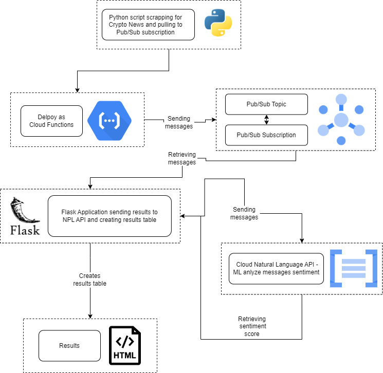
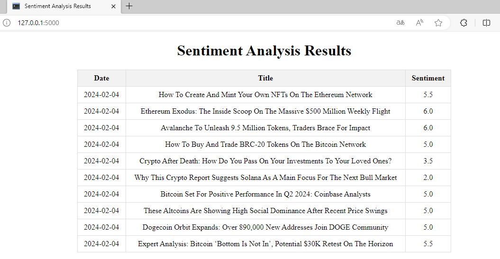

# CryptoSentiment
This project provides a comprehensive solution for collecting, analyzing, and visualizing sentiment data from cryptocurrency news using various Google Cloud services and technologies. To set up and run this project, you will need a Google Cloud Account, Terraform, Python, and pip.

## Project Objectives

The primary objectives of this project are as follows:

1. **Create Google Cloud Pub/Sub Topic**: This project creates a Google Cloud Pub/Sub Topic to act as a message broker for cryptocurrency news updates.

2. **Create Google Cloud Pub/Sub Subscription**: A corresponding Google Cloud Pub/Sub Subscription is created to subscribe to the cryptocurrency news updates published to the topic.

3. **Create Google Cloud Scheduler Job**: A Google Cloud Scheduler job is set up to trigger every minute, ensuring regular updates and data collection.

4. **Create Bucket for Storing News Data**: A Google Cloud Storage Bucket is established to store the news articles collected from various RSS feeds.

5. **Deploy Scraping Code as a Cloud Function**: The code responsible for scraping news articles is deployed as a Google Cloud Function, ensuring scalable and reliable data collection.

6. **Web Application with Flask for Message Reception**: Develop a web application using Flask that receives messages from the Pub/Sub Subscription.

7. **Web Application with Flask for Cloud Natural Language API Integration**: Extend the Flask web application to send messages to the Google Cloud Natural Language API and receive sentiment analysis data.

8. **Web Application with Flask for HTML Table Generation**: Enhance the Flask web application to create an HTML table displaying the sentiment analysis results.

## Project Architecture

## Project Preparation Steps

1. **Create a Google Cloud Project**:
   - Start by creating a new project in Google Cloud if you haven't already.

2. **Update Project Names**:
   - In the project files, update the project name in the following locations:
     - `/cloud_functions/scraper/main.py` (Line 7)
     - `/app/main.py` (Line 12)
     - `main.tf` (Line 4)
   - Optionally, you can also modify the region in `main.tf` (Line 5) if needed.
  
3. **Enable Google Cloud API**:
   1. Cloud Build API
   2. Cloud Functions API
   3. Cloud Scheduler API
   4. Cloud Natural Language API

4. **Create Service Account**:
   - In your Google Cloud project, create a service account and generate credentials.
   - Save the credentials as `credentials.json` and place them in your project directory.

5. **Compress Cloud Function Files**:
   - Compress all files in the `/cloud_functions/scraper` directory into a zip file named `scraper.zip`.

6. **Provision Cloud Infrastructure**:
   - From the project directory, execute the following commands to create the cloud infrastructure using Terraform:
     1. `terraform init`
     2. `terraform plan`
     3. `terraform apply`

7. **Install Python Dependencies**:
   - After creating the infrastructure, navigate to the `/app` directory and execute the following command to install Python dependencies:
     - `pip install -r requirements.txt`

8. **Run Flask Application**:
   - To start the Flask application, run the following command from the `/app` directory:
     - `python main.py`

With these steps completed, your project should be set up and ready for execution. Ensure that you've followed each step carefully to ensure the proper functioning of the application.

## Sample results

## Further Potential Project Development

As for further project development, there are several possibilities to consider:

1. **Deployment on Google App Engine**:
   - Consider migrating the Flask application to Google App Engine, which allows for scalability and automated infrastructure management.

2. **Database Expansion**:
   - To enable more in-depth data analysis, you can extend the project's architecture with a database such as Google Cloud SQL.
   - A database will enable the persistent storage and analysis of collected data, as well as access to more advanced data processing capabilities.

3. **Integration with Additional Data Sources**:
   - Consider adding the ability to gather data from other sources, such as social media platforms, discussion forums, or other cryptocurrency information sources.

4. **Automated Data Visualization**:
   - Create tools for automated data visualization to provide users with more advanced and interactive reports.

5. **Monitoring and Notifications**:
   - Add monitoring and notification features to inform users about significant sentiment changes or new cryptocurrency-related information.

6. **Extension of Cryptocurrency Support**:
   - If the project focuses on specific cryptocurrencies, consider adding support for various cryptocurrencies and tokens.

These opportunities expand the project and allow for the delivery of more advanced features and data analysis related to cryptocurrencies.
